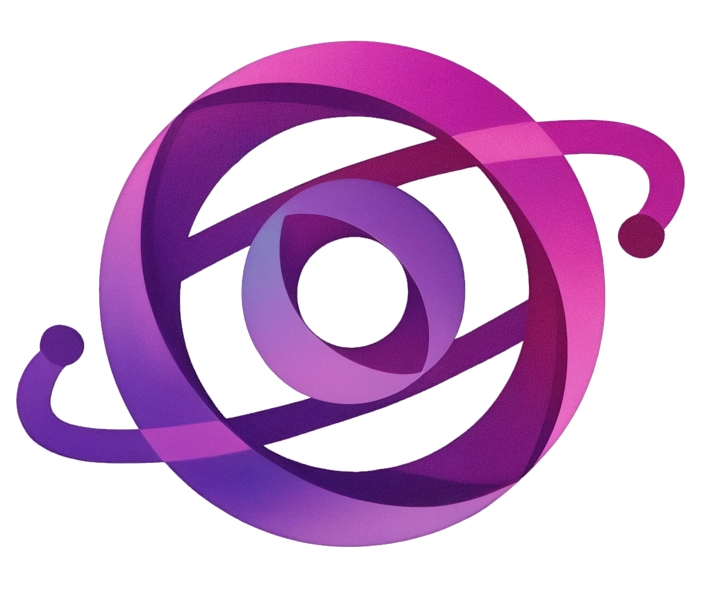

<p align="center">API Repo: https://github.com/Donny941/OrbisAPI</p>
<p align="center">
  
</p>

<h1 align="center">Orbis</h1>

<p align="center">
  <strong>Learn Together, Grow Together</strong><br/>
  A collaborative learning platform where communities share knowledge and grow through gamification
</p>

<p align="center">
  
  
  
  
  
</p>

---

## 📋 Table of Contents

- [About the Project](#-about-the-project)
- [Live Demo](#-live-demo)
- [Screenshots](#-screenshots)
- [Features](#-features)
- [Tech Stack](#-tech-stack)
- [Architecture](#-architecture)
- [Getting Started](#-getting-started)
- [API Documentation](#-api-documentation)
- [Database Schema](#-database-schema)
- [Gamification System](#-gamification-system)
- [Project Structure](#-project-structure)
- [Deployment](#-deployment)
- [Author](#-author)
- [License](#-license)

---

## 🔮 About the Project

**Orbis** is a full-stack collaborative learning platform built as a capstone project. Users join themed communities called **Orbs**, share educational resources using a rich text editor, and progress through a **gamification system** with levels, Orb Points, and daily streaks.

The platform encourages knowledge sharing by rewarding contributions: publishing resources, receiving appreciation (Orbs) from other users, and maintaining daily posting streaks all earn points. Higher-level users' votes carry more weight, creating an organic quality signal.

### Key Highlights

- **6 themed learning communities** (Programming, Web Dev, Data Science, Design, Languages, Science)
- **Rich text editor** powered by TipTap with code blocks, images, and links
- **5-tier leveling system** where your influence grows with your level
- **Weighted voting** — a Level 5 Master's orb is worth 3× a Novice's
- **Daily streak tracking** to encourage consistent participation
- **Voice dictation** for hands-free content creation
- **Dark/Light theme** with system preference detection
- **Fully responsive** — optimized for desktop, tablet, and mobile

---

## 🌐 Live Demo

| Service  | URL                                                                                      |
| -------- | ---------------------------------------------------------------------------------------- |
| Frontend | [orbis.alandonati.blog](https://orbis.alandonati.blog)                                   |
| API Docs | [Swagger UI](https://orbis-api-cnbye9bxfbevh6hc.westeurope-01.azurewebsites.net/swagger) |

> **Demo Credentials:** Register a new account or use the platform freely — it's open!

---

## ✨ Features

### Core Features

| Feature               | Description                                                     |
| --------------------- | --------------------------------------------------------------- |
| 🔐 Authentication     | JWT-based auth with access + refresh tokens, auto-renewal       |
| 🌐 Orbs (Communities) | 6 predefined themed communities to join and explore             |
| 📝 Resource Editor    | TipTap-powered rich text editor with code blocks, images, links |
| 📄 Draft/Publish      | Save drafts privately, publish when ready                       |
| ⭐ Orb Points         | Weighted voting system — higher levels give more valuable orbs  |
| 💬 Comments           | Flat comment system on resources with orb support               |
| 📊 Gamification       | 5 levels, point tracking, daily streaks, level-based perks      |
| 🏆 Leaderboard        | Global ranking with podium display and detailed stats           |
| 🔍 Search             | Full-text search with keyboard shortcut (⌘K / Ctrl+K)           |
| 👤 User Profiles      | Public profiles with stats, resources, and level display        |

### Additional Features

| Feature                | Description                                                |
| ---------------------- | ---------------------------------------------------------- |
| 🌙 Dark/Light Mode     | Theme toggle with localStorage persistence                 |
| 🎤 Voice Dictation     | Web Speech API integration for hands-free content creation |
| 🎯 Onboarding Tour     | 7-step guided tour with Shepherd.js for new users          |
| ❤️ Favourites          | Save and quick-access your favourite orbs                  |
| 🍪 Cookie Consent      | GDPR-compliant cookie banner with accept/decline           |
| 📜 Legal Pages         | Privacy Policy and Terms of Service                        |
| ❓ Help & FAQ          | Interactive FAQ with expandable answers                    |
| ⚙️ Settings            | User preferences and account management                    |
| 🛡️ Error Boundary      | Graceful error handling with recovery UI                   |
| 🔔 Toast Notifications | Real-time feedback with react-hot-toast                    |
| 📱 Responsive Design   | Optimized for desktop, tablet, and mobile with bottom nav  |

---

## 🛠️ Tech Stack

### Frontend

| Technology             | Purpose                              |
| ---------------------- | ------------------------------------ |
| **React 19**           | UI framework                         |
| **TypeScript 5.9**     | Type safety                          |
| **Vite 7**             | Build tool & dev server              |
| **Redux Toolkit**      | Global state management              |
| **React Router 7**     | Client-side routing                  |
| **Axios**              | HTTP client with interceptors        |
| **TipTap**             | Rich text editor (ProseMirror-based) |
| **Bootstrap 5 + SCSS** | Styling with custom design system    |
| **Lucide React**       | Icon library                         |
| **Shepherd.js**        | Onboarding tour                      |
| **react-hot-toast**    | Toast notifications                  |

### Backend

| Technology                  | Purpose                            |
| --------------------------- | ---------------------------------- |
| **ASP.NET Core 8.0**        | Web API framework                  |
| **Entity Framework Core 8** | ORM & migrations                   |
| **SQL Server**              | Relational database                |
| **ASP.NET Identity**        | User management & password hashing |
| **JWT Bearer**              | Authentication & authorization     |
| **Swashbuckle**             | Swagger/OpenAPI documentation      |

### Infrastructure

| Service                | Purpose                       |
| ---------------------- | ----------------------------- |
| **Azure App Service**  | Backend hosting (West Europe) |
| **Azure SQL Database** | Production database           |
| **Hostinger**          | Frontend hosting              |
| **GitHub**             | Version control               |

---

## 🏗️ Architecture

```
┌─────────────────────────────────────────────────────────────┐
│                        FRONTEND                             │
│  React 19 + TypeScript + Redux Toolkit + React Router       │
│  ┌──────────┐  ┌──────────┐  ┌──────────┐  ┌──────────┐     │
│  │  Pages   │  │Components│  │  Store   │  │ Services │     │
│  │ (16 pgs) │  │ (30+ cmp)│  │(4 slices)│  │ (Axios)  │     │
│  └──────────┘  └──────────┘  └──────────┘  └────┬─────┘     │
└──────────────────────────────────────────────────┼──────────┘
                                                   │ HTTPS
                                                   ▼
┌─────────────────────────────────────────────────────────────┐
│                        BACKEND                              │
│  ASP.NET Core 8.0 Web API                                   │
│  ┌──────────┐  ┌──────────┐  ┌──────────┐  ┌──────────┐     │
│  │Controllers│ │ Services │  │   DTOs   │  │Middleware│     │
│  │ (5 ctrl) │  │(4 svc)   │  │          │  │  (JWT)   │     │
│  └──────────┘  └──────────┘  └──────────┘  └──────────┘     │
│                       │                                     │
│              Entity Framework Core 8                        │
└──────────────────────┼──────────────────────────────────────┘
                       │
                       ▼
              ┌─────────────────┐
              │   SQL Server    │
              │   (8 tables)    │
              └─────────────────┘
```

### Data Flow

1. **User interacts** with the React UI
2. **Redux dispatches** an async thunk
3. **Axios sends** the request with JWT in Authorization header
4. **ASP.NET Core** validates the token, processes the request
5. **EF Core** queries/updates SQL Server
6. **Response flows back** through the same chain
7. **Redux updates** the store, React re-renders

---

## 🚀 Getting Started

### Prerequisites

- **Node.js** ≥ 18.x
- **.NET SDK** 8.0
- **SQL Server** (LocalDB, Express, or full)
- **Git**

### Clone the Repository

```bash
git clone https://github.com/Donny941/orbis.git
cd orbis
```

### Backend Setup

```bash
# Navigate to the API project
cd OrbisAPI

# Restore NuGet packages
dotnet restore

# Update the connection string in appsettings.json
# Default: "Server=(localdb)\\mssqllocaldb;Database=OrbisDb;Trusted_Connection=true"

# Apply database migrations
dotnet ef database update

# Run the API
dotnet run --launch-profile https
```

The API will be available at `https://localhost:7039` with Swagger UI at `/swagger`.

### Frontend Setup

```bash
# From the project root (where package.json is)
npm install

# Create a .env file (or edit the existing one)
echo "VITE_API_URL=https://localhost:7039/api" > .env

# Start the development server
npm run dev
```

The app will be available at `http://localhost:5173`.

### Environment Variables

**Frontend (`.env`)**

| Variable       | Description          | Example                      |
| -------------- | -------------------- | ---------------------------- |
| `VITE_API_URL` | Backend API base URL | `https://localhost:7039/api` |

**Backend (`appsettings.json`)**

| Key                                   | Description                  |
| ------------------------------------- | ---------------------------- |
| `ConnectionStrings:DefaultConnection` | SQL Server connection string |
| `Jwt:Key`                             | JWT signing secret           |
| `Jwt:Issuer`                          | Token issuer                 |
| `Jwt:Audience`                        | Token audience               |
| `Jwt:ExpireMinutes`                   | Access token expiry          |
| `Cors:AllowedOrigins`                 | Allowed frontend origin      |

---

## 📡 API Documentation

Full interactive documentation is available via **Swagger UI** when the backend is running.

### Endpoints Overview

#### Auth (`/api/auth`)

| Method | Endpoint         | Description               |
| ------ | ---------------- | ------------------------- |
| POST   | `/register`      | Create new account        |
| POST   | `/login`         | Authenticate & get tokens |
| GET    | `/me`            | Get current user profile  |
| POST   | `/refresh-token` | Refresh access token      |
| PUT    | `/profile`       | Update user profile       |

#### Orbs (`/api/orbs`)

| Method | Endpoint          | Description        |
| ------ | ----------------- | ------------------ |
| GET    | `/`               | List all orbs      |
| GET    | `/{id}`           | Get orb details    |
| POST   | `/{id}/join`      | Join an orb        |
| DELETE | `/{id}/leave`     | Leave an orb       |
| GET    | `/{id}/members`   | List orb members   |
| GET    | `/{id}/resources` | List orb resources |

#### Resources (`/api/resources`)

| Method | Endpoint        | Description                           |
| ------ | --------------- | ------------------------------------- |
| GET    | `/`             | List published resources (filterable) |
| GET    | `/mine`         | List current user's resources         |
| GET    | `/my-drafts`    | List current user's drafts            |
| GET    | `/{id}`         | Get resource detail                   |
| POST   | `/`             | Create new resource                   |
| PUT    | `/{id}`         | Update resource                       |
| DELETE | `/{id}`         | Delete resource                       |
| POST   | `/{id}/publish` | Publish a draft                       |
| POST   | `/{id}/orb`     | Give orb to resource                  |
| DELETE | `/{id}/orb`     | Remove orb from resource              |

#### Comments (`/api/comments`)

| Method | Endpoint                   | Description                 |
| ------ | -------------------------- | --------------------------- |
| GET    | `/resources/{id}/comments` | List comments on a resource |
| POST   | `/resources/{id}/comments` | Add a comment               |
| DELETE | `/{id}`                    | Delete a comment            |
| POST   | `/{id}/orb`                | Give orb to comment         |
| DELETE | `/{id}/orb`                | Remove orb from comment     |

#### Points (`/api/points`)

| Method | Endpoint       | Description                   |
| ------ | -------------- | ----------------------------- |
| GET    | `/summary`     | Current user's points summary |
| GET    | `/history`     | Points history (paginated)    |
| GET    | `/leaderboard` | Global leaderboard            |

---

## 🗄️ Database Schema

```
Users ─────────────┬──────────────── OrbMembers ──── Orbs
  │                │                                   │
  │                │                                   │
  └── Resources ───┼─────────────── ResourceOrbs ──────┘
        │          │
        │          │
        └── Comments ─── CommentOrbs
                   │
                   └──── OrbPointsHistory
```

### Tables

| Table                | Purpose                                         | Key Relations          |
| -------------------- | ----------------------------------------------- | ---------------------- |
| **Users**            | User accounts with level, points, streak        | Identity-managed       |
| **Orbs**             | 6 predefined learning communities               | Seeded on migration    |
| **OrbMembers**       | User ↔ Orb membership (unique per pair)         | FK to Users, Orbs      |
| **Resources**        | Learning content (Notes, Articles, Code, Links) | FK to Users, Orbs      |
| **ResourceOrbs**     | "Likes" with weighted points                    | FK to Resources, Users |
| **Comments**         | Flat comments on resources                      | FK to Resources, Users |
| **CommentOrbs**      | "Likes" on comments with weighted points        | FK to Comments, Users  |
| **OrbPointsHistory** | Audit log of all point transactions             | FK to Users            |

---

## 🎮 Gamification System

### Levels & Orb Weight

| Level | Name    | Points Required | Orb Weight |
| ----- | ------- | --------------- | ---------- |
| 1     | Novice  | 0 – 100         | 1.0×       |
| 2     | Student | 101 – 500       | 1.2×       |
| 3     | Scholar | 501 – 1,000     | 1.5×       |
| 4     | Expert  | 1,001 – 2,500   | 2.0×       |
| 5     | Master  | 2,500+          | 3.0×       |

### How Points Are Earned

| Action                  | Points              |
| ----------------------- | ------------------- |
| Publish a resource      | +10                 |
| Receive orb on resource | +5 × giver's weight |
| Receive a comment       | +2                  |
| Receive orb on comment  | +3 × giver's weight |
| Daily streak bonus      | +5                  |

### Streak Logic

- Post today (first time) → streak continues from yesterday or resets to 1
- Already posted today → no change
- Longest streak is tracked separately

---

## 📁 Project Structure

```
orbis/
├── OrbisAPI/                          # Backend
│   ├── Controllers/
│   │   ├── AuthController.cs
│   │   ├── OrbsController.cs
│   │   ├── ResourcesController.cs
│   │   ├── CommentsController.cs
│   │   └── PointsController.cs
│   ├── Data/
│   │   └── OrbisDbContext.cs          # EF Core context + seed data
│   ├── Model/
│   │   ├── Entity/                    # Domain entities
│   │   └── DTOs/                      # Data transfer objects
│   ├── Services/
│   │   ├── AuthService.cs
│   │   ├── ResourceService.cs
│   │   ├── CommentService.cs
│   │   └── PointsService.cs
│   ├── Migrations/
│   └── Program.cs                     # App configuration & DI
│
├── src/                               # Frontend
│   ├── components/
│   │   ├── layout/                    # Navbar, Sidebar, DashboardLayout, SearchOverlay
│   │   ├── auth/                      # LoginForm, RegisterForm, InitAuth, ProtectedRoute
│   │   ├── resources/                 # ResourceCard, TipTapEditor, OrbButton, VoiceDictation
│   │   ├── comments/                  # CommentList, CommentItem, CommentForm
│   │   ├── orbs/                      # OrbCard, OrbIcon
│   │   ├── ui/                        # ErrorBoundary, CookieBanner, FilterDropdown
│   │   └── onboarding/               # ShepherdTour, tourSteps
│   ├── pages/                         # 16 page components
│   │   ├── LandingPage.tsx
│   │   ├── DashboardHome.tsx
│   │   ├── OrbsPage.tsx
│   │   ├── OrbDetailPage.tsx
│   │   ├── ResourcesPage.tsx
│   │   ├── ResourceEditorPage.tsx
│   │   ├── ResourceDetailPage.tsx
│   │   ├── MyResourcesPage.tsx
│   │   ├── FavouritesPage.tsx
│   │   ├── ProfilePage.tsx
│   │   ├── UserProfilePage.tsx
│   │   ├── LeaderboardPage.tsx
│   │   ├── SettingsPage.tsx
│   │   ├── HelpPage.tsx
│   │   ├── PrivacyPolicyPage.tsx
│   │   └── TermsPage.tsx
│   ├── store/
│   │   ├── store.ts                   # Redux store configuration
│   │   ├── hooks.ts                   # Typed useDispatch/useSelector
│   │   └── slices/                    # authSlice, orbsSlice, resourcesSlice, commentSlice
│   ├── hooks/                         # useTheme, useTour
│   ├── styles/
│   │   ├── _variables.scss            # Design tokens
│   │   ├── themes/                    # _dark.scss, _light.scss
│   │   ├── mixins/                    # Reusable SCSS mixins
│   │   ├── components/                # 20+ component stylesheets
│   │   └── main.scss                  # Entry point
│   ├── utils/                         # Helper functions
│   ├── App.tsx                        # Router configuration
│   └── main.tsx                       # App entry point + Axios setup
│
├── services/                          # API service layer
│   ├── api.ts                         # Axios instance + interceptors
│   ├── resourceService.ts
│   └── commentService.ts
│
├── types/                             # TypeScript interfaces
│   └── index.ts
│
└── package.json
```

---

## ☁️ Deployment

The application is live and deployed:

- **Frontend** → [orbis.alandonati.blog](https://orbis.alandonati.blog) (Hostinger)
- **Backend** → Azure App Service (.NET 8.0, West Europe)
- **Database** → Azure SQL Server

---

## 👤 Author

**Alan Donati**

- GitHub: [@Donny941](https://github.com/Donny941)
- Website: [alandonati.blog](https://alandonati.blog)
- Email: dev@alandonati.blog

---

## 📄 License

This project is built as a capstone project for educational purposes. All rights reserved.

---

<p align="center">
  Built with 💜 using React, .NET, and a lot of coffee
</p>
